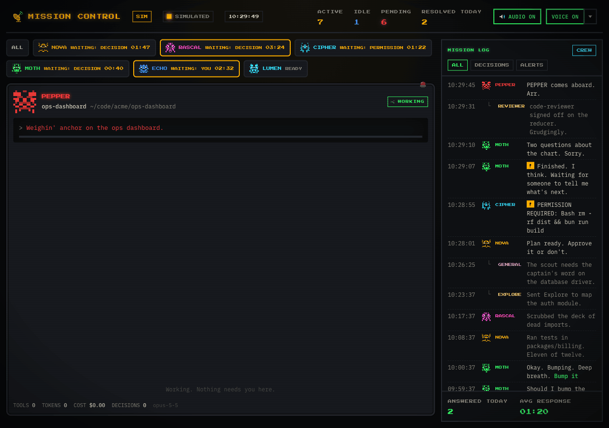
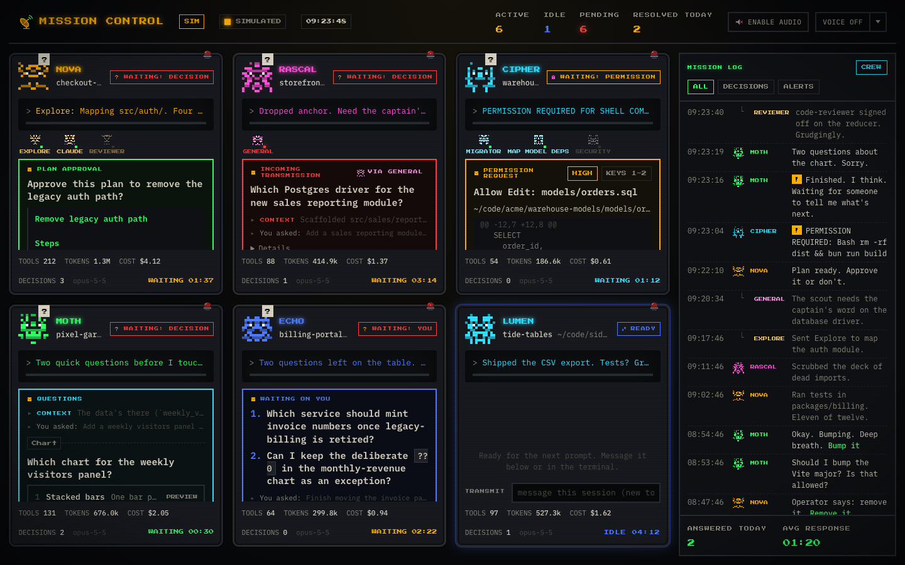
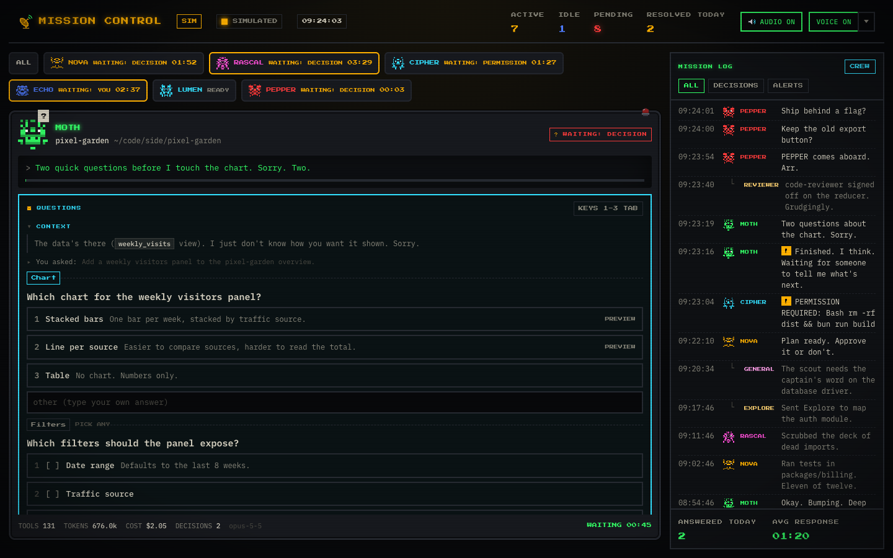

# Agent Mission Control [](https://github.com/dannyhawkins/agent-mission-control/actions/workflows/ci.yml)

One screen for every Claude Code session on your machine.

If you run four or five Claude Code sessions at once, questions and permission prompts get
buried in scrollback and sessions sit blocked without you noticing. Mission Control puts each
session on a station of a retro control-room floor. Anything that needs you arrives there as a
card, with enough context to decide, and your answer goes straight back into the waiting
session. The longer a station waits, the louder it gets.

It is local-first. The hub is a single Bun process on `127.0.0.1:4242` with SQLite in
`~/.agent-mission-control/`. Nothing leaves your machine unless you turn on the optional
ElevenLabs voice.



## Unofficial project

Agent Mission Control is an independent project. It is not affiliated with, endorsed by or
supported by Anthropic. It relies on some Claude Code behaviour that is not documented and may
change in any release: the per-session messaging socket, `CLAUDE_CODE_SESSION_ID` in the MCP
server's environment, and some hook payload fields. It is alpha software (0.x).

| Tested with | Status |
| --- | --- |
| Claude Code 2.1.280 to 2.1.282 on macOS | Works |
| Linux builds | Built in CI, untested with real sessions so far |

If a Claude Code update breaks something, please [open a bug](https://github.com/dannyhawkins/agent-mission-control/issues/new/choose)
with the output of `claude --version` and `amc doctor`.

[Contributing](CONTRIBUTING.md) · [Code of conduct](CODE_OF_CONDUCT.md) ·
[Security](SECURITY.md) · [MIT licence](LICENSE)

## What lands on the floor

| Card | Where it comes from | How your answer gets back |
| --- | --- | --- |
| **Questions** | Claude Code's own multiple-choice question tool (`AskUserQuestion`), up to four questions per card, multi-select and free text | Returned to the tool call, as if you had picked in the terminal |
| **Plan approval** | Claude asking you to approve a plan before it starts work (`ExitPlanMode`) | Approve, Approve + auto-accept edits, or Keep planning with a note Claude reads as your feedback |
| **Permission** | Any prompt for Bash, Write, Edit, MultiEdit or NotebookEdit, with the full command or a diff of the change | Allow or deny, with an optional note |
| **Incoming transmission** | The `request_decision` MCP tool, for forks Claude chooses to escalate | The tool call returns your choice or your typed answer |
| **Waiting on you** | A turn that ends with questions written as plain text | Typed reply delivered into the session, which picks it up in a new turn |

The terminal prompt still appears alongside every card. Answer wherever you are looking: the
first answer wins, and the card clears itself if you answered in the terminal.

When a turn ends with questions in prose, a Stop hook first sends the turn back once and asks
Claude to use the question tool instead, so most of those become proper question cards.

## What else is on a station

- **Persona.** Every session gets a callsign, a pixel sprite and a voice that lasts across
  resumes of that session.
- **Crew bay.** Subagents, in-process teammates and nested `claude` runs appear as mini sprites
  on the session that spawned them, not as stations of their own. Their questions land on the
  parent's station, tagged with the child's role.
- **History.** The last 80 tool calls as one line each, with what they touched, for example
  `Edit · apps/web/src/hub/state.ts`. It survives reloads and hub restarts.
- **Context.** Every card shows your last prompt and what Claude said just before asking, read
  from the session transcript.
- **Escalation.** A waiting station glows amber at 2 minutes, strobes red at 5 and sounds the
  klaxon at 10. An idle session, one that has finished its turn, shows a calm blue READY state
  that never escalates.
- **Transmit box.** Send any session a new topic or a comment. An idle session starts a new
  turn with it. A working one folds it into its current turn after the next tool call.

## Requirements

- macOS or Linux (arm64 or x64). Messaging a session uses its local Unix socket.
- Claude Code 2.1.280 or later. The integration points were verified against that version.
- Nothing else for the `amc` binary. Building from source needs [Bun](https://bun.sh) 1.3 or
  later and [go-task](https://taskfile.dev).

## Quick start

Everything ships as one `amc` binary: the hub with its UI built in, the wiring commands and the
MCP server Claude Code launches.

```sh
brew install dannyhawkins/tap/amc
amc start                       # the hub and its UI on :4242, in this terminal
amc wire --global --gate        # in another terminal: every Claude Code session reports in
open http://127.0.0.1:4242
claude -c                       # restart each running session once so it loads the wiring
```

No Homebrew? Download the tarball for your platform from
[GitHub Releases](https://github.com/dannyhawkins/agent-mission-control/releases) and check it
against `SHA256SUMS`. [docs/install.md](docs/install.md) has the steps for each platform,
upgrading and uninstalling. `amc doctor` says what is wrong when something is.

`amc wire --global` merges hooks into `~/.claude/settings.json` and registers the MCP server for
all your projects as `<path to amc> mcp`, after writing a timestamped backup of the settings
file. It keeps your existing hooks and settings. Wiring records where `amc` lives, so rewire if
you move the binary (Homebrew's path stays put across upgrades). Running sessions need a
restart (`claude -c` resumes the conversation) because each session loads its MCP servers when
it starts.

The hub runs in the foreground of whatever terminal starts it; there is no login item yet
([#2](https://github.com/dannyhawkins/agent-mission-control/issues/2)). After a reboot, run
`amc start` again. Its data lives in `~/.agent-mission-control` (`AMC_DATA_DIR`).

**Upgrading from a checkout install.** Wiring made by `task wire*` before `amc` existed points
Claude Code at `bun <checkout>/packages/mcp-server/src/index.ts`. Run `amc wire --global --gate`
(add `--telemetry` if you had it) and it rewrites every such entry it finds, user scope, local
scope and each known project's `.mcp.json`, to the binary, and prints what changed.
`amc doctor` lists any it missed.

### From source

```sh
task install                    # bun install + git hooks
task start                      # build the UI and run the hub on :4242
task wire:global -- --gate      # same as amc wire, run from this checkout
task build:bin                  # or build dist/amc and put it on your PATH
```

From a checkout the MCP server is wired as `bun <checkout>/apps/cli/src/main.ts mcp`, so no
build is needed. `bun apps/cli/src/main.ts <command>` is `amc <command>`.

## Tear-down

To pause without unwiring, stop the hub with `Ctrl+C`. Sessions carry on as normal: hooks fail
silently, gated prompts fall back to the terminal, and `request_decision` tells Claude to ask in
chat instead.

To remove Mission Control completely:

```sh
# 1. Remove the global wiring: our hooks, env keys (including telemetry) and the
#    user-scope MCP server. Your own hooks and settings stay; a backup is written first.
amc unwire --global

# 2. Remove any per-project wiring you added, shared or --local.
amc unwire ~/Code/some-project

# 3. Stop the hub (Ctrl+C in its terminal), then delete its data: the SQLite
#    database with sessions, decisions and history, plus config.json.
rm -rf ~/.agent-mission-control

# 4. Optional: delete the settings backups that wiring and unwiring wrote.
rm ~/.claude/settings.json.amc-backup-*

# 5. Remove the binary.
brew uninstall amc              # or delete the amc you copied onto your PATH
```

Restart running Claude Code sessions afterwards so they drop the hooks and the MCP server.

## Wiring options

| Command | What it does |
| --- | --- |
| `amc wire --global --gate` | Every session reports in. Permission prompts, questions and plan approvals come to the floor. |
| `amc wire --global --gate-questions-only` | Every session reports in. Only questions and plan approvals come to the floor; tool permissions stay in the terminal. |
| `amc wire --global --gate --telemetry` | Adds Claude Code's OpenTelemetry export to the hub, so stations show tokens and cost. Prompt text is never exported. It refuses to overwrite an existing telemetry setup that points elsewhere. |
| `amc wire --global --snippet` | Also appends guidance on when to call `request_decision` to `~/.claude/CLAUDE.md`. Off by default. |
| `amc wire <dir> --local --gate` | Wires one project using only files git does not track: `.claude/settings.local.json`, the local MCP scope and `CLAUDE.local.md`. |
| `amc wire <dir> --gate` | Wires one project into its shared files. It warns before writing to a git-tracked file. |
| `amc unwire <dir>` | Removes exactly what wiring added to that project and restores committed files byte for byte. |
| `amc doctor [dir]` | Checks the hub and its version, the global and project wiring (including wiring that still points at a checkout), Claude Code's version, telemetry and socket settings, and which ElevenLabs key the running hub uses (never the key itself). Exits 1 when something is broken. |

Add `--dry-run` to `amc wire` to print what it would change, `--port` when the hub is not on
4242, and `--home <dir>` to wire a Claude config dir other than `~/.claude`. From a checkout,
`task wire DIR=<dir>` prints and `task wire DIR=<dir> -- --write` applies, as before.

## Configuration

Set these as environment variables when starting the hub. `ignoreCwd` and `socketReply` can
also go in `~/.agent-mission-control/config.json`; environment variables win.

| Variable | Default | What it does |
| --- | --- | --- |
| `AMC_PORT` | `4242` | Hub port. Rewire after changing it, since hooks carry the URL. |
| `AMC_HOST` | `127.0.0.1` | Bind address. Keep it on loopback; the hub has no auth (see `SECURITY.md`). Requests must also carry a loopback `Host` with the hub port. |
| `AMC_DATA_DIR` | `~/.agent-mission-control` | SQLite database and `config.json`. |
| `AMC_IGNORE_CWD` | `~/.claude-mem` | Comma-separated folders whose sessions are ignored completely. Their prompts pass straight to the terminal. |
| `AMC_NUDGE` | on | `off` stops the Stop hook asking Claude to turn prose questions into a question card. |
| `AMC_SOCKET_REPLY` | on | `off` stops replies and messages being delivered through session sockets. |
| `AMC_GATE_TIMEOUT_MS` | `540000` | How long a gated prompt waits for you before falling back to the terminal. |
| `AMC_OFFLINE_AFTER_MS` | 30 minutes | Silence before a session counts as offline. |
| `AMC_CREW_STALE_MS` | 10 minutes | Silence before a working subagent or teammate with no stop event is treated as done. |
| `AMC_TEAMMATE_STANDBY_MS` | 4 hours | Silence before a teammate on standby (between tasks) leaves the crew bay. |
| `AMC_CLAUDE_HOME` | `~/.claude` | Where agent team rosters are read from (`teams/<team>/config.json`, read only). |
| `AMC_DROP_OFFLINE_AFTER_MS` | 24 hours | How long an offline session stays in the off-shift strip. |
| `AMC_LOG` | `info` | Hub log level: `quiet`, `info` or `debug`. |
| `ELEVENLABS_API_KEY` | unset | Turns on the optional ElevenLabs voice (see [Voice](#voice)). Better kept in `secrets.env`. Never logged or sent to the UI. |
| `AMC_ELEVENLABS_URL` | `https://api.elevenlabs.io` | ElevenLabs API base URL (tests point it at a fake). |
| `AMC_ELEVENLABS_MODEL` | `eleven_flash_v2_5` | ElevenLabs model. `eleven_multilingual_v2` sounds richer and costs twice as much per character. |
| `AMC_TTS_DAILY_CHARS` | `20000` | Characters per day the hub may send to ElevenLabs. Cached lines are free. |
| `AMC_TTS_PREWARM` | on | `off` stops the hub rendering a session's six core lines in the background after its first line. |

## Using the floor

| Key or action | Effect |
| --- | --- |
| `1` to `6` | Pick an option on the most urgent card |
| `Tab` / `Shift+Tab` | Move between questions on a question card |
| `Enter` | Send the card, or send the transmit box |
| Click a station's header, or `F` | Focus mode: the station takes over the floor and the others become tiles |
| `Esc` | Leave focus mode |
| Enable Audio | Arms the chiptune cues; browsers need one click first |

The mission log on the right lists every decision and alert, newest first. The CREW toggle
shows or hides lines from child agents.



## Voice

VOICE in the header reads out new cards, stations standing by, stations waiting five minutes
and new sessions, in each persona's own voice. The caret next to it picks which of those are
spoken, the rate, and the provider:

- **Browser** (default). The browser's own speech voices, offline. On macOS, download a
  Premium or Enhanced voice (System Settings, Accessibility, Spoken Content, System voice,
  Manage Voices) and restart the browser; stations prefer Premium, then Enhanced voices.
  Every station on the floor gets a different voice while there are enough, plus its own
  pitch and rate.
- **ElevenLabs** (optional). The hub renders each line with ElevenLabs and caches the mp3, so
  every line of every persona is paid for once. Each live session gets its own stock voice,
  the best fit for its character not already used by another live session (a pirate gets a
  husky trickster, a bureaucrat a mature, reassuring one), with delivery nudged per persona so
  no two sound alike. The popover lists each station's voice with a **reroll** button; a
  voice sticks to its session across resumes and hub restarts. When a line cannot be fetched
  (hub down, no key, daily cap reached, ElevenLabs error or timeout) that line is spoken by
  the browser voice and the popover says why.

Each persona always phrases an event the same way. When a session first speaks through
ElevenLabs, the hub pre-renders its six core lines (on the floor, standing by, has a question,
permission to run Bash, plan approval, waiting five minutes; about 250 characters); anything
else is rendered the first time it is said.

To turn ElevenLabs on, give the hub a key. The recommended place is a file only you can read,
which the hub re-reads when you open the voice popover, so a new or rotated key needs no
restart:

```sh
printf 'ELEVENLABS_API_KEY=%s\n' 'sk_...' > ~/.agent-mission-control/secrets.env
chmod 600 ~/.agent-mission-control/secrets.env
```

The hub ignores the file, with a warning in its log, while anyone but you can read it.
`ELEVENLABS_API_KEY` in the hub's environment works too and **wins over the file**. Watch for
this when a key is exported in a shell profile (`~/.zshrc`): the hub silently uses that one and
your `secrets.env` is ignored (the hub logs "ELEVENLABS_API_KEY from the environment wins over
secrets.env"). Start the hub with `env -u ELEVENLABS_API_KEY amc start` to use the file.
`amc doctor` reports which source the running hub uses and warns when your shell exports a
key alongside `secrets.env`.

**What is sent to ElevenLabs:** only the fixed announcement lines, built from the callsign, a
count, a tool or agent role name and the persona's stock phrasing ("Ahoy! Nova has a
question."). Card content, prompts, questions and answers are never sent. The hub counts the
characters it sends per day against `AMC_TTS_DAILY_CHARS` and keeps at most 50 MB of audio in
`~/.agent-mission-control/voice-cache/`, dropping the least recently played first.



## Worth knowing

- **Messages you send are relayed, not typed.** Claude Code labels anything arriving on a
  session's socket as a message from another session. Claude acts on it for ordinary requests,
  but may confirm risky steps in the terminal. Sessions in bypass-permissions mode hold these
  messages until approved.
- **The socket interface is undocumented.** Replies and messages use Claude Code's
  cross-session socket, which a Claude Code update could change. When delivery fails, the card
  falls back to "answer in the terminal".
- **Restarting the hub drops pending gate cards.** Each gated prompt holds a connection open
  while it waits, so a restart sends those sessions back to their terminal prompt. Check the
  floor for pending cards before restarting.
- **Headless `claude -p` runs have no question tool**, so only permission prompts and
  `request_decision` apply to them.

## Development

```sh
task dev            # hub with --watch, plus Vite on 127.0.0.1:5173 proxying to the hub
task sim            # three simulated sessions against a running hub
task check          # biome + tsc + bun test
task build:bin      # dist/amc for this platform, UI embedded
task build:bin:all  # dist/amc-<os>-<arch> for darwin and linux, arm64 and x64
```

Open `http://127.0.0.1:5173/?mock=1` to run the whole UI against a built-in simulator, with
no hub or real sessions needed. [CONTRIBUTING.md](CONTRIBUTING.md) covers setup, checks,
commit messages and pull requests.

| Path | What |
| --- | --- |
| `apps/hub` | Bun server: hook receiver, gate, OTLP receiver, decision API, WebSocket, SQLite, static UI |
| `apps/web` | Vite + React floor |
| `apps/cli` | The `amc` binary: `start`, `wire`, `unwire`, `doctor`, `mcp`; `build.ts` compiles it with the UI embedded |
| `packages/mcp-server` | stdio MCP server with `request_decision` and `report_status`, one per session (`amc mcp`) |
| `packages/shared` | The wire contract every part builds against |
| `scripts` | `wire.ts` (the old flags, forwarded to `amc wire`), `dev-sim.ts` for simulated sessions, `render-formula.ts` for the Homebrew formula |
| `packaging/homebrew` | Formula template the release workflow renders into the tap |
| `apps/web/public/assets/_src/make.ts` | Source of every pixel-art asset |

## Further reading

- [Install](docs/install.md): Homebrew, release tarballs and building from source, upgrading
  and uninstalling.
- [Architecture](docs/architecture.md): input channels, how answers are routed, and the
  trade-offs behind each route.
- [Runbook](docs/runbook.md): wiring details, what a card shows, and troubleshooting.
- [Releasing](docs/releasing.md): tagging a release from main, what the release workflow
  builds, and the Homebrew tap token.
- [CLAUDE.md](CLAUDE.md): verified Claude Code facts and design rulings, for agents working on
  this repo.

## Licence

[MIT](LICENSE). Contributions are welcome: see [CONTRIBUTING.md](CONTRIBUTING.md) and the
[code of conduct](CODE_OF_CONDUCT.md). Report security problems privately as described in
[SECURITY.md](SECURITY.md).
